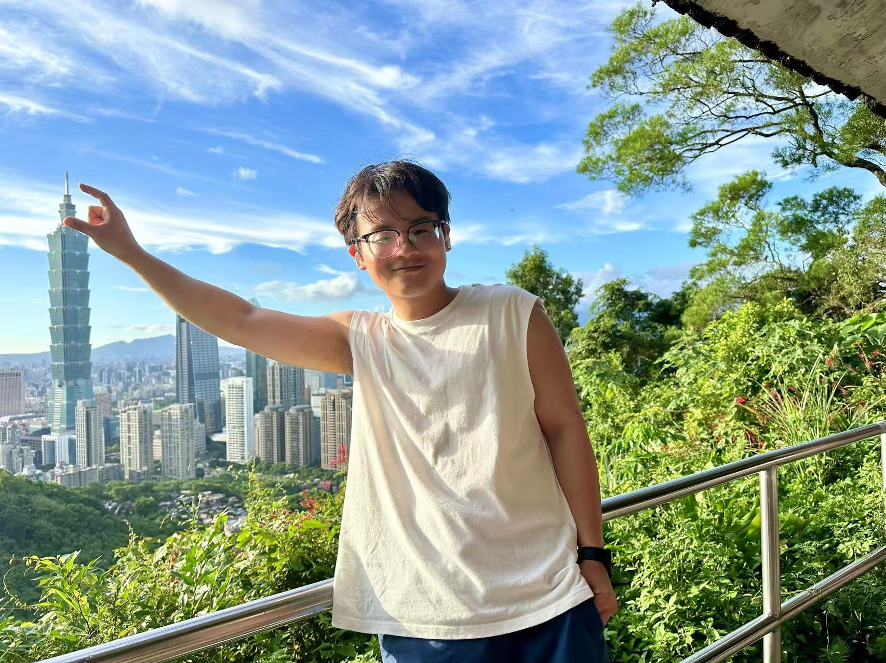

# Ye Zhenyu's Homepage
## About me
### Basic Information
<table border="0">
  <tr>
    <td width="70%">
      <h3>Name: Ye Zhenyu(叶 振宇)</h3>
      
<b>Education Background for Now: Bachelor Degree in Mathematics</b>

    </td>
    <td width="30%">
       
    </td>
  </tr>
</table>

### About Me
>I'm a Mphil student under the supervision of Conan Leung. I'm interested in higgs bundle, an object which connects different parts of mathematics such as differential geometry, complex algebraic geometry and symplectic geometry.

## Education

> + **2019 —— 2023: Chinese University of Minging and Technology, Beijing —— Undergraduate;**
> + **2023 —— now:  Chinese University of Hongkong —— Master of Philosophy**

## Math Notes about Higgs Bundle and Hitchin Moduli
> + [Moduli Space of Flat Connection on Puncture Riemann Surface](Punctured_Riemann_Surface.pdf)
> + [The Self Duality Equation on a Riemann Surface, N.Hitchin](SelfdualityEQuation.pdf)
> + [Harmonic Bundle over Non Compact Curves, C.Simpson](Simpson‘s_Harmonic_Bundle.pdf)
> + [A weight two phenomenon for the moduli of rank one local systems on open varieties, C.Simpson](Weight2_Rank1_by_Simpson.pdf)
> + [From the Hitchin section to opers through nonabelian Hodge, DFKMMN](from_hitchin_section_to_opers.pdf)
> + [Higgs Bundle and SYZ Geometry, S.Heller](HiggsBundleandSYZ.pdf)
> + [Loop group methods for the non-abelian Hodge correspondence on a 4-punctured sphere, S.Heller](LoopGroupMethod.pdf)
> + [Hyper-Kähler Structures on Moduli Spaces of Parabolic Higgs Bundles on Riemann Surfaces, H.Nakajima](Nakajima.pdf)
> + [Symplectic geometry of a moduli space of framed Higgs bundles, I.Biswas](Symplectic_form_on_framed_higgs_bundle_biswas.pdf)

## Notes of Core Course
> + [Integrable PDE and DH-Moduli I.pdf](IntegrablePDEandDH-ModuliI.pdf)
> + [Integrable PDE and DH-Moduli II.pdf](IntegrablePDEandDH-ModuliII.pdf)
> + [Integrable PDE and DH-Moduli III.pdf](IntegrablePDEandDH-ModuliIII.pdf)
> + [Integrable PDE and DH-Moduli IV.pdf](Integrable_PDE_and_DH-Moduli_IV.pdf)

## My Emails
> + **Email 1: zyye@math.cuhk.edu.hk**
> + **Email 2: zhenyuyemath@gmail.com**

